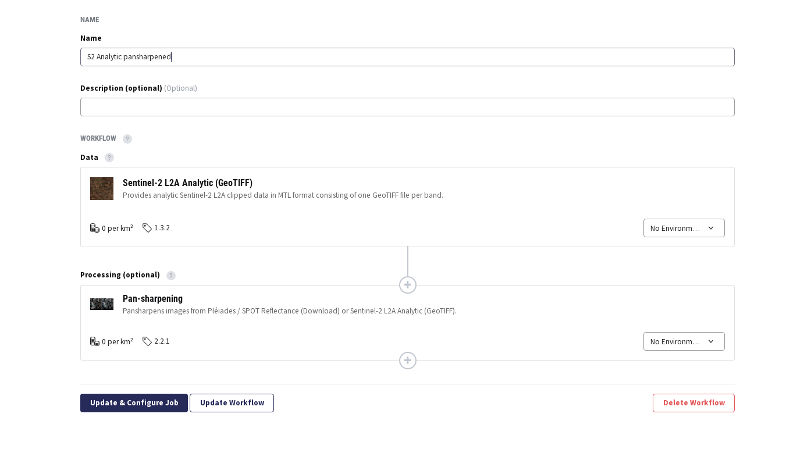
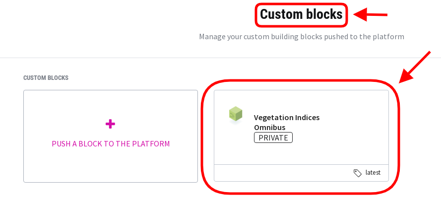
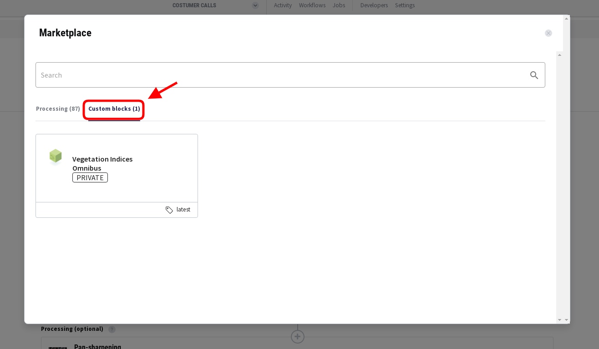
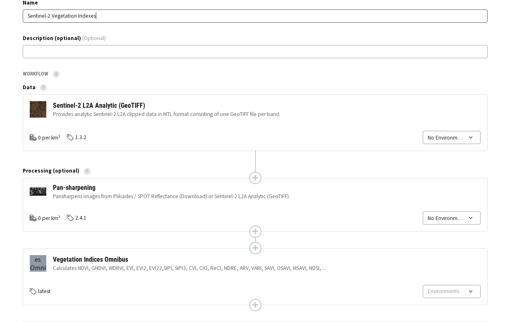

# Simple custom block to calculate vegetation indexes

## Introduction

The code in this repository implements a very simple block that
computes various vegetation indexes for
[Pléiades](https://docs.up42.com/getting-started/data-products/pleiades),
[SPOT 6/7](https://docs.up42.com/getting-started/data-products/spot/)
and [Sentinel-2](https://sentinel.esa.int/web/sentinel/missions/sentinel-2 "Sentinel-2").

 * [NDVI](https://en.wikipedia.org/wiki/Normalized_difference_vegetation_index) -
   Normalized Difference Vegetation Index
 * [GNDVI](https://www.indexdatabase.de/db/i-single.php?id=28) - Green
   Normalized Difference Vegetation Index
 * [WDRVI](https://www.indexdatabase.de/db/i-single.php?id=125) - Wide
   Dynamic Range Vegetation Index
 * [EVI](https://en.wikipedia.org/wiki/Enhanced_vegetation_index) -
   Enhanced Vegetation Index
 * [EVI2](https://www.indexdatabase.de/db/si-single.php?sensor_id=96&rsindex_id=237) -
   Enhanced Vegetation Index 2
 * [EVI2-2](https://www.indexdatabase.de/db/i-single.php?id=576) -
   Enhanced Vegetation Index 2 - 2
 * [SIPI](https://www.indexdatabase.de/db/i-single.php?id=90) -
   Structure Intensive Pigment Index
 * [SIPI3](https://www.indexdatabase.de/db/i-single.php?id=291) -
   Structure Intensive Pigment Index 3d
 * [CVI](https://www.indexdatabase.de/db/i-single.php?id=391) -
   Chlorophyll Vegetation Index
 * [CIG](https://www.indexdatabase.de/db/i-single.php?id=128) -
   Chlorophyll Index Green
 * [ReCI](https://www.indexdatabase.de/db/i-single.php?id=190) - Red
   Edge Chlorophyll Index
 * [NDRE](https://www.indexdatabase.de/db/i-single.php?id=223) -
   Normalized Difference Red Edge
 * [ARVI](https://www.indexdatabase.de/db/i-single.php?id=4) -
   Atmospherically Resistant Vegetation Index
 * [VARI](https://www.indexdatabase.de/db/i-single.php?id=356) -
   Visible Atmospherically Resistant Index
 * [SAVI](https://en.wikipedia.org/wiki/Soil-adjusted_vegetation_index) -
   Soil-Adjusted Vegetation Index
 * [OSAVI](https://www.indexdatabase.de/db/i-single.php?id=63) -
   Optimized Soil Adjusted Vegetation Index
 * [MSAVI](https://www.indexdatabase.de/db/i-single.php?id=44) -
   Modified Soil Adjusted Vegetation Index
 * [NDSI](http://space4water.org/taxonomy/term/1247) - Normalized
   Difference Snow Index
 * [NDWI/NDWI2](https://en.wikipedia.org/wiki/Normalized_difference_water_index) -
   Normalized Difference Water Index for water body detectiion (NDWI)
   and for drought and irrigation management (NDWI2)
 * [BAI](https://www.space4water.org/taxonomy/term/1255) - Burn Area Index
 * [NBR](https://un-spider.org/advisory-support/recommended-practices/recommended-practice-burn-severity/in-detail/normalized-burn-ratio) -
   Normalized Burn Ratio

The calculation is done using the
[OrfeoToolbox BandMath](https://www.orfeo-toolbox.org/CookBook/Applications/app_BandMath.html?highlight=bandmath)
utility.

Writen in C++, the [OrfeoToolbox](https://www.orfeo-toolbox.org/)
(OTB) is maintained by the French Space Agency &mdash; [Centre National
d'Études Spatiales](https://cnes.fr/en) (CNES). It consists of a series of command line
utilities to work with remote sensing data sets from a user point of
view. It offers a toolkit/library to program remote sensing algorithms
in C++.

It has also a [Python API](https://www.orfeo-toolbox.org/CookBook/PythonAPI.html) and
a [QGIS](https://www.orfeo-toolbox.org/CookBook/QGISInterface.html)
interface.

Performance wise OTB offers [Streaming and Threading](https://www.orfeo-toolbox.org/CookBook/C++/StreamingAndThreading.html)
for handling large datasets effectively.

### Inputs & outputs

This block takes as input a set of Level 2A Sentinel-2 images, a
Pléiades or SPOT 6/7 reflectance products for analysis.

The output is a set [GeoTIFF](https://en.wikipedia.org/wiki/GeoTIFF) files.

### Block capabilities

The block takes a set of GeoTIFF files as input
[capability](https://docs.up42.com/developers/blocks/capabilities)
and delivers a GeoTIFF as output capability.

## Requirements

### Generic

 1. [docker](https://docs.docker.com/install/).
 2. [GNU make](https://www.gnu.org/software/make/).

### For [local development](#local-development)

 1. [Bash](https://en.wikipedia.org/wiki/Bash_(Unix_shell)).
 2. [cURL](https://curl.haxx.se).
 3. [jq](https://stedolan.github.io/jq/).
 4. [GNU core utilities](https://www.gnu.org/software/coreutils/coreutils.html).
 5. [moreutils](https://joeyh.name/code/moreutils/).
 6. [OrfeoToolbox](https://www.orfeo-toolbox.org/).

## Usage

### Command line arguments

The script accepts up to four **optional** commmand line arguments:

 * `-p`: A JSON document with the parameters accepted by the block.
 * `-i`: The input directory. The path to the `data.json` file of the
   input imagery is.
 * `-o`: The output directory. The path to the `data.json` file of the
   output imagery is.
 * `-t`: Path to the  `otbcli_BandMath` utility from OTB.

If any of the optional arguments are not given the script uses
defaults. These are:

 * block parameters (`-p`): it extracts these from the string given as
   value of the `UP42_TASK_PARAMETERS` environment variable.
 * input directory (`-i`): `/tmp/input`
 * output directory (`-o`): `/tmp/output`
 * path to `otbcli_BandMath` (`-p`): obtained from the operating
   system. It uses `command -v` from Bash to find the path.

### Clone the repository

```bash
git clone git@github.com:up42/simple-vegetation-indexes-block.git <directory>
```
where `<directory>` is the directory where the cloning is done.

### Build the docker images

For building the images you should tag the image such that it can be
pushed to the UP42 docker registry, enabling you to run it as a custom
block. For that you need to pass your UP42 user ID (UID) in the `make`
command.

The quickest way to get that is just to go into the UP42 console and
copy & paste from the last clipboard that you get at the
[custom-blocks](https://console.up42.com/custom-blocks) page and after
clicking on **PUSH a BLOCK to THE PLATFORM**. For example, it will be
of the form:

    https://console.up42.com/custom-blocks?workspace=<UID>

where your `UID` is also the workspace ID.

Now you can launch the image building using `make` like this:

```bash
make build UID=<UID>
```

You can avoid selecting the exact UID by using `pbpaste` in a Mac (OS
X) or `xsel --clipboard --output` in Linux and do:

```bash
# Mac OS X.
make build UID=$(pbpaste | cut -f 2 -d '=')

# Linux.
make build UID=$(xsel --clipboard --output | cut -f 2 -d '=')
```

You can additionaly specifiy a custom tag for your image (default tag
is `simple-vegetation-indexes:latest`):

```bash
make build UID=<UID> DOCKER_TAG=<docker tag>
```

if you don't specify the docker tag, it gets the default value of `latest`.


```bash
# mac: OS X.
make build UID=$(pbpaste | cut -f 2 -d '=') DOCKER_TAG=<docker tag>

# Linux.
make build UID=$(xsel --clipboard --output | cut -f 2 -d '=') DOCKER_TAG=<docker tag>
```

After the image is pushed you should be able to see your custom block
in the [console](https://console.up42.com/custom-blocks/) and you can
now use the block in a workflow.

### Run the processing block locally

#### Configure the job

To run the docker image locally you need first to configure the job
with the parameters specific for this block. Create a `params.json`
file like this:

```json
{
  "indexes": `<indexes>`,
  "arvi_y": `<arvi_y>`,
  "wdrvi_a": `<wdrvi_a>`,
  "ram": `<RAM size in MB>`
}
```
where:

 + `<indexes>`: JS array of possible vegataion indexes,
 + `<arvi_y>`: value of y coefficient for computing ARVI.
 + `<wdrvi_a>`: value of a coefficient for computing WDRVI.
 + `<RAM size in MB>`: the RAM size in MB made available to OTB.

Here is an example `params.json`:

```json
{
   "indexes":[
   "ndvi",
   "gndvi",
   "evi",
   "evi2",
   "evi22",
   "arvi",
   "vari",
   "sipi",
   "sipi3",
   "savi",
   "osavi",
   "msavi",
   "cvi",
   "cig",
   "reci",
   "ndre",
   "ndsi",
   "ndwi",
   "ndwi2",
   "bai"
   ],
 "arvi_y": 0.16,
 "ram": 512
}
```
#### Get the data

You need to get data samples to provide as input to to the block. To
do that you can create a UP42 workflow consisting of any of the
following data sources:

 * [Pléiades 1A/1B reflectance](https://up42.com/marketplace/blocks/data/oneatlas-pleiades-fullscene)

 * [SPOT 6/7 reflectance](https://up42.com/marketplace/blocks/data/oneatlas-spot-fullscene)
and
 * [Sentinel-2A/Sentinel-2B analytic](https://up42.com/marketplace/blocks/data/esa-s2-l2a-gtiff-analytic)

For processing you need to add
[pansharpening](https://up42.com/marketplace/blocks/processing/pansharpen).


Here is the way a [workflow](https://docs.up42.com/getting-started/workflows/editor) looks like in the console if we choose
Sentinel-2 as the data source.



You can now proceed to select an Area Of Interest (AOI) and block
parameters in the [job configuration](https://docs.up42.com/getting-started/jobs/configuration).

You can also use the example job parameters given in the
`shell/examples/job-params` directory. Just copy & paste to the job
configuration editor text area.

After the job runs you can proceed to download the results and extract
the archive (tarball) into a directory of your choosing. It is this
directory that will be specified in the command line.

```bash
mkdir /path/to/sample_data
```

Now untar the tarball with the results in that directory:

```bash
tar -C /path/to/sample_data -zxvf <downloaded tarball>
```
You also need to define an output directory. For example:

```bash
mkdir /path/to/output_of_sample_data
```

#### Run the block

```bash
make run INPUT_DIR=/path/to/sample_data OUTPUT_DIR=/path/to/output_of_sample_data
```

This [bind mounts](https://docs.docker.com/storage/bind-mounts/)
input and output directories respectively to `/tmp/input` and
`/tmp/output` inside the container. You can look ate the `config.mk`
file for the options passed to `docker run`.

If you set a custom docker tag then the command to run the block is:

```bash
make run INPUT_DIR=/path/to/sample_data OUTPUT_DIR=/path/to/output_of_sample_data DOCKER_TAG=<docker tag>
```

If you are satisfied with the results obtained locally then you can
proceed to push the block to UP42 so that you can use it as a custom
block in your workflows.

### Before pushing: validate the manifest

Before pushing the block you must validate the manifest. You will
always be able to push the block even if the manifest is invalid,
but in that case you won't be able to use the block in any workflow.

```bash
make validate
```

For a valid manifest the response is:

```json
{
  "data": {
    "valid": true,
    "errors": []
  },
  "error": null
}
```

### Push the image to the UP42 registry

You first need to login into the UP42 docker registry.

```bash
make login USERNAME=me@example.com
```

where `me@example.com` should be replaced by your username, which is
the email address you use for your  UP42 aacount.

Now you can finally push the image to the UP42 docker registry:

```bash
make push UID=<UID>
```

where `<UID>` is user ID referenced above. Again using the copy &
pasting on the clipboard.

```bash
# Mac OS X.
make push UID=$(pbpaste | cut -f 2 -d '=')

# Linux.
make push UID=$(xsel --clipboard --output | cut -f 2 -d '=')
```

```bash
make push UID=<UID>
```
Note that if you specified a custom docker tag when you built the image, you
need to pass it now to `make`.

```bash
make push UID=<UID> DOCKER_TAG=<docker tag>
```

where `<UID>` is user ID referenced above. Again using the copy &
pasting on the clipboard.

```bash
# Mac OS X.
make push UID=$(pbpaste | cut -f 2 -d '=') DOCKER_TAG=<docker tag>

# Linux.
make push UID=$(xsel --clipboard --output | cut -f 2 -d '=') DOCKER_TAG=<docker tag>
```

### Using the block in workflows

Once the block is pushed is should show up as a custom block in the
console.



You can now add it to a workflow.



And a complete workflow using the block.




### Going further: local development

If you intend to modify the code, the Makefile provides some useful
commands.

To clean all dangling container images do:

```bash
make clean
```

To build a container image **without** relying on the build cache do:

```bash
make build-clean UID=<UID>
```
You can avoid selecting the exact UID by using `pbpaste` in a Mac (OS
X) or `xsel --clipboard --output` in Linux and do:

```bash
# Mac OS X.
make build-clean UID=$(pbpaste | cut -f 2 -d '=')

# Linux.
make build-clean UID=$(xsel --clipboard --output | cut -f 2 -d '=')
```

If you set a custom tag for your image (default tag
is `simple-vegetation-indexes:latest`):

```bash
make build-clean UID=<UID> DOCKER_TAG=<docker tag>

```

### Support

 1. Open an issue here.
 2. Mail us [support@up42.com](mailto:support@up42.com).
